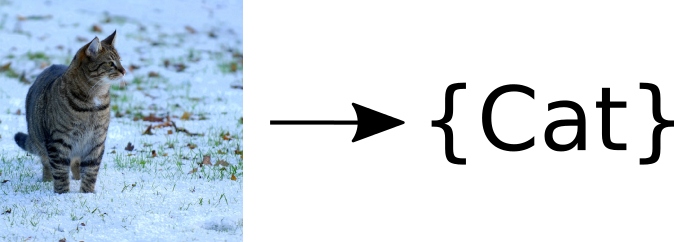

Title: Paper Discussion Group
Category: Projekte
Date: 2015-11-25 17:30
Tags: Paper, Deep Learning, Autonomes Fahren
Authors: Marvin Teichmann, Martin Thoma

# Nächstes Treffen
<figure style="display:table;float:right">

<figcaption style="display:table-caption;caption-side:bottom">ImageNet Classification Challenge:  
AlexNet erkennt Katzen!</figcaption>
</figure>

* Datum: 25.11.2015, 17:30
* Ort:  Seminarraum: -107, Infobau (Geb. 50.34)
* Thema: AlexNet: Die Renaissance der tiefen Neuronalen Netz
* Experte: Marvin Teichmann

In diesem Treffen möchte ich mit euch über *AlexNet* reden. *AlexNet* ist ein
tiefes Neuronales Netz, welches 2010 überraschend die *ImageNet Classification
Challenge* gewann. Dies leitete eine Renaissance von Deep Learning ein, welche
bis heute anhält. Viele aktuell führende Netze, wie beispielsweise *GoogLeNet*<a class="simple-footnote" title="Christian Szegedy et al., &quot;Going Deeper with Convolutions&quot;, 2014." href="#sf-paper-discussion-group-2">2</a>, sind Weiterentwicklungen von *AlexNet*.

In dem ersten Treffen möchte ich mit euch verstehen was *AlexNet* so
erfolgreich macht. Wir diskutieren dazu die neuen Ideen zum Trainieren und
Evaluieren des Netzes und untersuchen die neue Netzarchitektur.

## Vorbereitung
Beschäftigt euch bitte im Vorfeld mit folgender Quelle:

1. Das Paper über [AlexNet](http://www.cs.toronto.edu/~fritz/absps/imagenet.pdf)<a class="simple-footnote" title="Alex Krizhevsky, Ilya Sutskever, Geoffrey E. Hinton, &quot;ImageNet Classification with Deep Convolutional Neural Networks&quot;, 2012." href="#sf-paper-discussion-group-1">1</a>.

## Ausblick
Aufbauen auf *AlexNet* können wir im folgenden Treffen über *GoogLeNet* reden.
Alternativ ist es möglich ein praktisches Treffen zu organisieren bei dem es
darum geht ein Netz selber mit *Tensor Flow* zu implementieren (vgl.
[Training your first Neural Network](http://ml-ka.de/training-your-first-neural-network/).
Außerdem können wir uns mit den neuen *FCNN* Ansatz von Jon Long und Evan
Shelhamer beschäftigen. Wie es konkret weitergeht möchte ich am Ende des ersten
Treffens mit euch besprechen.

# Literatur zu CNNs und Deep-Learning
Wer selber mal gerne ein Netz trainieren möchte, dem empfehle ich das [Lasagne
Tutorial](http://martin-thoma.com/lasagne-for-python-newbies/) von Martin
Thoma. Für die Paper-Discussion Group ist es allerdings nicht Voraussetzung
bereits praktisch mit CNNs gearbeitet zu haben.

# Paper Liste
Eine Auswahl relevanter Paper zum Thema Deep Learning und Pixel-weiser
Klassifikation.

1. [AlexNet] ImageNet Classification with Deep Convolutional Neural Networks,
   *Alex Krizhevsky et. al* (**NIPS 2012**)
2. [GoogleLeNet] Going Deeper with Convolutions,
   *Szegedy et. al* (**ArXiv 2014**)
3. [FCNN] Fully Convolutional Networks for Semantic Segmentation,
   *Jon Long and Evan Shelhamer et. al* (**CVPR2015**)
4. [SegNet] SegNet: A Deep Convolutional Encoder-Decoder Architecture for
   Image Segmentation, *Vijay Badrinarayanan et. al* (**ArXiv 2015**)

# Fragen
Beantworte ich gerne. Schreib mir einfach eine kurze E-Mail:
marvxx.teichmaxx@gmaxx.com

Fragen zu Frameworks könnt ihr Martin stellen: `info@martin-thoma.de`

# Vergangene Treffen

## Erstes Treffen
<figure style="display:table;float:right">

<figcaption style="display:table-caption;caption-side:bottom">Schematische Darstellung von CNNs. 
Quelle: Stanford Deep Learning Tutorial</figcaption>
</figure>

* Datum: 11. November, 17:30
* Ort:  Seminarraum: -107, Infobau (Geb. 50.34)
* Thema: Stanford Deep Learning Tutorial
* Experte: Marvin&nbsp;Teichmann

In dem ersten Treffen möchte ich mit euch über das [Deep Learning Tutorial](http://ufldl.stanford.edu/tutorial/) der Universität Stanford sprechen. Dieses gibt einen kompakten sehr guten Einstieg in moderne tiefe CNNs.

Aufbauend auf dem Tutorial können wir in weiteren Treffen über aktuell führende
Netze, wie *AlexNet*[ref]Alex Krizhevsky, Ilya Sutskever, Geoffrey E. Hinton, "[ImageNet Classification with Deep Convolutional
Neural Networks](http://www.cs.toronto.edu/~fritz/absps/imagenet.pdf)", 2012.[/ref] oder *GoogLeNet* [ref]Christian Szegedy et al., "[Going Deeper with Convolutions](http://arxiv.org/abs/1409.4842)", 2014.[/ref] diskutieren. Außerdem besteht die
Möglichkeit, dass wir mit Lasagne einfache Netze selber implementieren.

### Vorbereitung
Beschäftigt euch bitte im Vorfeld mit dem [Deep Learning Tutorial](http://ufldl.stanford.edu/tutorial/) der Universität Stanford. Relevante Abschnitte sind:

*  [Multi-Layer Neural Network](http://ufldl.stanford.edu/tutorial/supervised/MultiLayerNeuralNetworks/)
* [Feature Extraction Using Convolution](http://ufldl.stanford.edu/tutorial/supervised/FeatureExtractionUsingConvolution/)
* [Pooling](http://ufldl.stanford.edu/tutorial/supervised/Pooling/)
* [ConvolutionalNeuralNetwork](http://ufldl.stanford.edu/tutorial/supervised/ConvolutionalNeuralNetwork)
* [Autoencoders](http://ufldl.stanford.edu/tutorial/unsupervised/Autoencoders/)

Das Stanford Tutorial ist recht anspruchsvoll. Für ML Einsteiger kann es
hilfreich sein einzelne Schlagwörter auch in externen Quellen (zum Beispiel
Wikipedia) nachzulesen. Bitte lasst euch von offenen Fragen oder
Verständnisschwierigkeiten nicht abschrecken. Hierfür ist auch die Diskussion
Group da.

# Quellen
