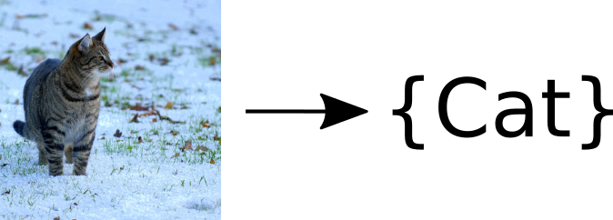

Title: Paper Discussion Group
Category: Projekte
Date: 2015-10-22 13:20
Tags: Paper, Pixelweise Klassifikation, Autonomes Fahren
Authors: Marvin Teichmann

In der Projektgruppe wollen wir die neuesten Entwicklungen im Bereich *Pixelweiser Klassifikation mit tiefen Neuronalen Netzen* diskutieren. 

## Nächstes Treffen

<figure style="display:table;float:right">

<figcaption style="display:table-caption;caption-side:bottom">ImageNet Classification Challenge:    AlexNet erkennt Katzen!</figcaption>
</figure>

* Datum: 11. November, 17:30
* Ort: TBA
* Thema: AlexNet: Die Renaissance der tiefen Neuronalen Netz
* Experte: Marvin Teichmann

In dem ersten Treffen der Paper Discussion Group möchte ich mit euch über *AlexNet* reden. *AlexNet* ist ein tiefes Neuronales Netz, welches 2010 überraschend die *ImageNet Classification Challenge* gewann. Dies leitete eine Renaissance von Deep Learning ein, welche bis heute anhält. Viele aktuell führende Netze, wie beispielsweise *GoogleLeNet* [2], sind Weiterentwicklungen von *AlexNet*.

In dem ersten Treffen möchte ich mit euch verstehen was *AlexNet* so erfolgreich macht. Wir diskutieren dazu die neuen Ideen zum Trainieren und Evaluieren des Netzes und untersuchen die neue Netzarchitektur. 

###Vorarbeit:
Beschäftigt euch bitte im Vorfeld mit folgenden Quellen:

1. Das [Deep Learning Tutorial](http://ufldl.stanford.edu/tutorial/) der Universität Stanford. Relevante Abschnitte sind:
	*  [Multi-Layer Neural Network](http://ufldl.stanford.edu/tutorial/supervised/MultiLayerNeuralNetworks/)
	* [Feature Extraction Using Convolution](http://ufldl.stanford.edu/tutorial/supervised/FeatureExtractionUsingConvolution/)
	* [Pooling](http://ufldl.stanford.edu/tutorial/supervised/Pooling/)
	* [ConvolutionalNeuralNetwork](http://ufldl.stanford.edu/tutorial/supervised/ConvolutionalNeuralNetwork)
2. Das Paper über [AlexNet](http://www.cs.toronto.edu/~fritz/absps/imagenet.pdf) [1]. 

Ich habe das Feedback erhalten, dass viele Interessenten kein Vorwissen über Deep Learning haben. Daher habe ich mich entschieden, dass wir zu Begin des Treffens uns kurz mit dem [Deep Learning Tutorial](http://ufldl.stanford.edu/tutorial/) beschäftigen. Das *AlexNet* Paper ist definitiv für (motivierte) Deep Learning Neulinge geeignet.

Insgesammt ist der Inhalt aber natürlich sehr anspruchsvoll. Lasst euch davon bitte nicht davon abschrecken, wenn Ihr nicht alles versteht. Die Diskussions Gruppe dient auch dazu gemeinsam die Inhalte besser zu verstehen. Bei Fragen könnt Ihr euch gerne jederzeit an mich wenden, ich bin täglich auf dem Campus und gut über Email erreichbar. 

###Ausblick:
Aufbauen auf *AlexNet* können wir im folgenden Treffen über *GoogleLeNet* reden. Alternativ ist es möglich ein praktisches Treffen zu organisieren bei dem es darum geht ein Netz selber mit *Lasagne* zu Implementieren. Außerdem können wir uns mit den neuen *FCNN* Ansatz von Jon Long und Eve Shelhamme beschäftigen. Wie es konkret weitergeht möchte ich am Ende des ersten Treffens mit euch besprechen. 

## Literatur zu CNNs und Deep-Learning

Wer selber mal gerne ein Netz trainieren möchte, dem empfehle ich das [Lasagne Tutorial](http://martin-thoma.com/lasagne-for-python-newbies/) von Martin Thoma. Für die Paper-Discussion Group ist es allerdings nicht voraussetzung bereits praktisch mit CNNs gearbeitet zu haben.

## Paper Liste

1. [AlexNet] ImageNet Classification with Deep Convolutional Neural Networks, *Alex Krizhevsky et. al* (**NIPS 2012**)
2. [GoogleLeNet] Going Deeper with Convolutions, *Szegedy et. al* (**ArXiv 2014**)

## Fragen

Beantworte ich gerne, sowohl Inhaltlich als auf Rund um die Diskussion Group. Schreib mir einfach eine kurze Email: marvxx.teichmaxx@gmaxx.com

