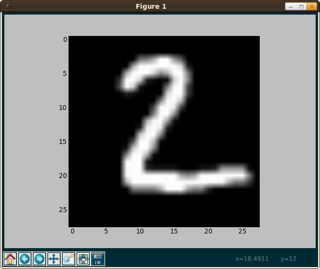

Title: Training your first Neural Network
Category: Projekte
Date: 2015-12-02 21:10
Tags: Deep Learning, MNIST, Tensor Flow
Authors: Martin Thoma

The following article gives you the necessary knowledge to train and evaluate a
neural network to solve the MNIST task on Kaggle. You will get three
interesting abilities:

1. Working with Tensor Flow
2. Working with medium-sized datasets
3. Using Kaggle

Additionally, you will get some knowledge about Python. Python is the language
of my choice when it comes to quickly trying some ideas.


## What is MNIST?

<figure style="display:table;float:right">

<figcaption style="display:table-caption;caption-side:bottom">One example of an item in the MNIST dataset - the digit 2</figcaption>
</figure>

MNIST is a dataset of 28px&nbsp;×&nbsp;28px digits. The training set contains
60,000 examples and the test set contains 10,000 examples. If you want to know
more, you can read the [official Website](http://yann.lecun.com/exdb/mnist/).


## The Framework: Tensor Flow

Tensor Flow is a framework which allows you to train neural networks with GPU,
but also with CPU. I've wrote a couple of words in a blog post:
[Tensor Flow - A quick impression](http://martin-thoma.com/tensor-flow-quick/)

### Using GPU at ATIS

KIT students have the possibility to use the ATIS computer pool. They have
some computer at the very end of the room which have GPUs (i08pc50 - i08pc72;
GeForce GTX 560 Ti 448 Cores).

Recently, CUDA 7.5 was installed on the Fedora systems, but you still have
to add the following lines to your `~/.bashrc` file:

```text
export PATH=$PATH:"/opt/cuda-7.5/bin"
export LD_LIBRARY_PATH=$LD_LIBRARY_PATH:"/opt/cuda-7.5/lib64"
```

Make sure it appears when you execute `echo $PATH` and `echo LD_LIBRARY_PATH`.
If it doesn't, execute `source ~/.bashrc`. Depending on your configuration,
you might have to do this every time when you start a new console session.

UPDATE: I've tried it very quickly and it seems not to work out of the box in
ATIS. However, you can sill use your personal computer.

The error I get is

```bash
Traceback (most recent call last):
  File "tftest.py", line 4, in <module>
    import tensorflow as tf
  File "/home/stud/s_thoma/.local/lib/python2.7/site-packages/tensorflow/__init__.py", line 4, in <module>
    from tensorflow.python import *
  File "/home/stud/s_thoma/.local/lib/python2.7/site-packages/tensorflow/python/__init__.py", line 22, in <module>
    from tensorflow.python.client.client_lib import *
  File "/home/stud/s_thoma/.local/lib/python2.7/site-packages/tensorflow/python/client/client_lib.py", line 35, in <module>
    from tensorflow.python.client.session import InteractiveSession
  File "/home/stud/s_thoma/.local/lib/python2.7/site-packages/tensorflow/python/client/session.py", line 11, in <module>
    from tensorflow.python import pywrap_tensorflow as tf_session
  File "/home/stud/s_thoma/.local/lib/python2.7/site-packages/tensorflow/python/pywrap_tensorflow.py", line 28, in <module>
    _pywrap_tensorflow = swig_import_helper()
  File "/home/stud/s_thoma/.local/lib/python2.7/site-packages/tensorflow/python/pywrap_tensorflow.py", line 24, in swig_import_helper
    _mod = imp.load_module('_pywrap_tensorflow', fp, pathname, description)
ImportError: libcudart.so.7.0: cannot open shared object file: No such file or directory
```


## What is Kaggle?

Kaggle is a Machine Learning competition website. It describes tasks in a very
simple way, provides the data and lets you instantly compare yourself (or
rather your results) with others. With this article, you should be able to make
a decent submission for the
[Digit Recognizer](https://www.kaggle.com/c/digit-recognizer) task.


## What to do

1. Get a Python installation and get a feeling how Python works. If you didn't
   use Python before, I suggest reading chapters 1-5 of the
   [official Python 2 tutorial](https://docs.python.org/2/tutorial/).
2. [Install Tensor Flow](http://www.tensorflow.org/get_started/os_setup.html)
3. Make sure Tensor Flow works
4. Read the [MNIST For ML Beginners](http://www.tensorflow.org/tutorials/mnist/beginners/index.html) tutorial
5. Register at Kaggle, download the data for the
   [Digit Recognizer task](https://www.kaggle.com/c/digit-recognizer), adjust
   your implementation from step&nbsp;5 and make a submission to Kaggle.


## Questions

### How do I get Python?

I have to admit that I always worked on systems which already had a running
Python installation. This is one reason why I really like working with
Ubuntu (Linux). You only have to execute `sudo apt-get install python-pip` and
you're ready to go.

The official page is [www.python.org/downloads](https://www.python.org/downloads/).
If you're having trouble getting a working Python installation, don't hesitate
to ask for help.


### How do I check if my Python installation is working?

Go to the command line and execute `python --version`. My output is `Python 2.7.6`.
As long as you get something like `Python 2.7.X` it is ok. Tensor Flow works
only with Python&nbsp;2, not with Python&nbsp;3.

Then execute `pip --version`. It should output something like

```
$ pip --version
pip 6.0.6 from /usr/local/lib/python2.7/dist-packages/pip-6.0.6-py2.7.egg (python 2.7)
```

pip is a package manager for Python. You might need it to install several
packages, including Tensor Flow.


### How do I make sure Tensor Flow works?

Create a `testtf.py` with the following content:

```python
#!/usr/bin/env python

import tensorflow as tf
hello = tf.constant('Hello, TensorFlow!')
sess = tf.Session()
print(sess.run(hello))

a = tf.constant(10)
b = tf.constant(32)
print(sess.run(a + b))

```

Execute it with the command `python testtf.py`. For me, the output is

```text
I tensorflow/core/common_runtime/local_device.cc:25] Local device intra op parallelism threads: 12
I tensorflow/stream_executor/cuda/cuda_gpu_executor.cc:888] successful NUMA node read from SysFS had negative value (-1), but there must be at least one NUMA node, so returning NUMA node zero
I tensorflow/core/common_runtime/gpu/gpu_init.cc:88] Found device 0 with properties: 
name: GeForce GTX TITAN Black
major: 3 minor: 5 memoryClockRate (GHz) 0.98
pciBusID 0000:01:00.0
Total memory: 6.00GiB
Free memory: 5.77GiB
I tensorflow/core/common_runtime/gpu/gpu_init.cc:112] DMA: 0 
I tensorflow/core/common_runtime/gpu/gpu_init.cc:122] 0:   Y 
I tensorflow/core/common_runtime/gpu/gpu_device.cc:643] Creating TensorFlow device (/gpu:0) -> (device: 0, name: GeForce GTX TITAN Black, pci bus id: 0000:01:00.0)
I tensorflow/core/common_runtime/gpu/gpu_region_allocator.cc:47] Setting region size to 5884919808
I tensorflow/core/common_runtime/local_session.cc:45] Local session inter op parallelism threads: 12
Hello, TensorFlow!
42

```

The important part is

```text
Hello, TensorFlow!
42
```

if you don't get that, there is something wrong.